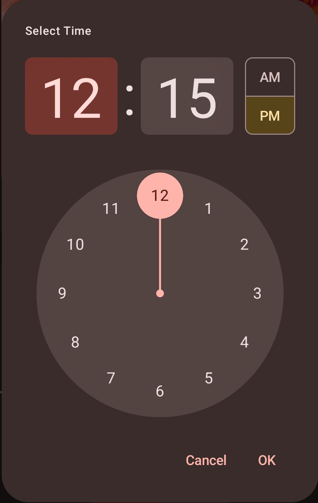

# AndroidUtils
This Repository contains utility/helper classes and functions to facilitate Android App Development!
- I'll be constantly adding new stuff!
- you can contribute and give feedback!

# Helper Classes
## LocalFileStorageRepository

- A file storage class providing functions to read, write, update, delete image files
  from your App's Internal/private storage, and also make a Bitmap from a content Uri! 
- powered by kotlin coroutines and flow so its thread safe!

# Jetpack Compose Custom material 3 Components

## Material 3 Time Picker Tile and Dialog

  
  

## Animated Fab Menu
- A Custom Android UI component, Build with Jetpack Compose, allows you to add a beautiful material 3 designed floating menu, which can be shown or hidden with beautiful animations by pressing the attached FAB..

  

